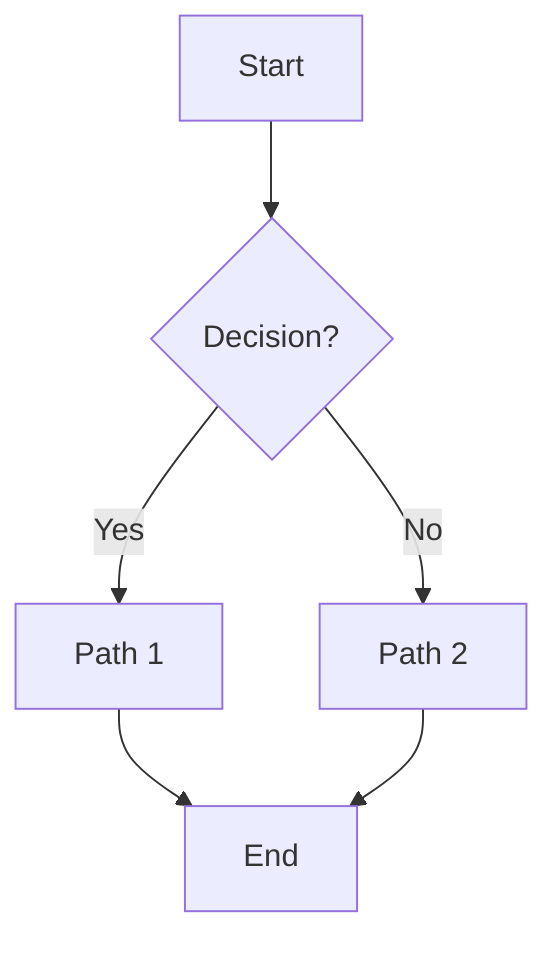

# Mermaid Support (Essentials)

`sys-design-diagram` supports Mermaid (`*.mmd`) alongside PlantUML (`*.puml`) and diagrams Python files (`*.py`). The official images (`aydabd/sys-design-diagram` / `ghcr.io/aydabd/sys-design-diagram`) include `@mermaid-js/mermaid-cli` **and** a Chromium binary (headless) pre-installed—no host Node.js setup required.

## Quick Usage

Process only Mermaid files:
```bash
sys-design-diagram mermaid -d designs/ -o output/
```

Process everything (PlantUML, diagrams, Mermaid):
```bash
sys-design-diagram process-all -d designs/ -o output/
```

## Rendering & Fallback Behavior

The image bundles Chromium and a Puppeteer config at `/opt/puppeteer-config.json` with flags:

```json
{ "args": ["--no-sandbox", "--disable-setuid-sandbox", "--disable-dev-shm-usage", "--disable-gpu", "--disable-software-rasterizer"] }
```

This makes headless launches stable in rootless containers. If Chromium fails to launch (rare: kernel restrictions, seccomp, AppArmor) the tool writes a **placeholder PNG** containing the original Mermaid source instead of failing the entire run.

To harden (enable real sandboxing) build a derivative image removing the "no-sandbox" arguments and enabling user namespaces / setuid sandbox depending on distro.

Environment variables that influence Mermaid rendering:

| Variable | Purpose |
|----------|---------|
| `MERMAID_PUPPETEER_CONFIG` | Path to Puppeteer JSON (auto-set to `/opt/puppeteer-config.json`). |
| `SDD_MERMAID_EXTRA_ARGS` | Extra CLI args appended to `mmdc` (e.g. `--scale 1.3 --theme dark`). |

Example with scaling & dark theme:

```bash
docker run --rm \
  -e SDD_MERMAID_EXTRA_ARGS="--scale 1.3 --theme dark" \
  -v "$PWD/designs:/designs:ro" -v "$PWD/out:/output" \
  ghcr.io/aydabd/sys-design-diagram:latest mermaid
```

## Minimal Mermaid Example


## Tips
* Prefer `process-all` for mixed repositories to avoid multiple directory walks.
* If you see placeholder PNGs, inspect logs for sandbox / Chromium messages.
* Use `-v` (verbose) to surface per-task timings and any suppressed warnings.
* For deterministic themes across diagrams, supply `SDD_MERMAID_EXTRA_ARGS="--theme neutral"`.

That’s all you need for Mermaid usage. For more examples, just add additional `.mmd` files under your design folders.
